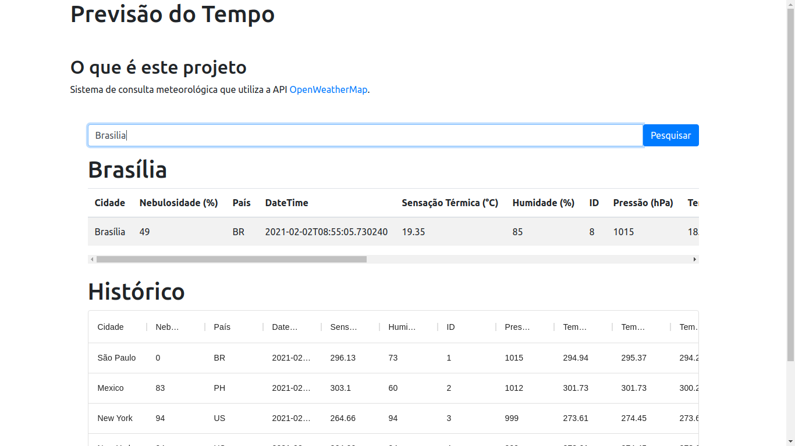

# Teste de Conhecimentos Técnicos

Teste para análise de conhecimentos técnicos.

## Objetivo

Construir uma aplicação que efetue chamadas para a API [OpenWeatherMap](https://openweathermap.org/) e apresentar seus dados meteorológicos de forma compreensível para o usuário.

### Requisitos

- As informações devem ser armazenadas em um banco de dados;

- Histórico de consultas;

- Campo de pesquisa;

- Área de apresentação dos dados;

- Visualizar previsão detalhada de mais dias;

- Aplicação publicada no GitHub; e

- README detalhado e didático.

### Requisitos de Tecnologia

- Interface React;

- Servidor Web em Python, podendo utilizar *framework*;

- Banco de Dados PostgreSQL, podendo utilizar *ORM*; e

- Permitida a utilização de quaisquer dependências devidamente justificadas.

## Projeto Desenvolvido

Tecnologias utilizadas e guia de instalação.

### Tecnologias Utilizadas

Para atuar no back-end optei pelo Flask, um framework web. Devido ao fato de já ter contato com o mesmo em projetos anteriores de estudo.

- Back-End (Python)
  - Flask -> framework web
  - Flask-SQLAlchemy -> *ORM*
  - Flask-Migrate -> ferramenta de migração
  - Flask-Cors -> lidar com Cross Origin Resource Sharing
  - flask-marshmallow -> serialização simples de objetos
  - marshmallow-sqlalchemy -> (de)serialização
  - psycopg2 -> adaptador do banco de dados PostgreSQL para Python
  - requests -> requisição para API
  - python-dotenv -> variáveis de ambiente para desenvolvimento
  - virtualenv -> virtualização do ambiente de desenvolvimento

- Front-End (React)
  - Bootstrap -> estilo
  - material-ui/data-grid -> criação/formatação de tabelas

- Ambiente de Desenvolvimento
  - Linux
  - VSCode
  - Docker
  - Insomnia

### Instalação

Em um ambiente com Python, PIP, NodeJS e Yarn instalados, é possível executar a aplicação. Também é preciso ter um banco de dados PostgreSQL em execução.

- Iniciando o Servidor Back-End

Altere o arquivo `__init.py` com o endereço do seu banco de dados:

```python
app.config['SQLALCHEMY_DATABASE_URI'] = 'postgresql+psycopg2://<usuario>:<senha>@<ip>:5432/<bd>'
```

Com o banco de dados devidamente referenciado, instale as dependências necessárias para o back-end:

```shell
cd backend
python -m pip install -r requirements.txt
```

Após instalação das dependências, execute a migração do banco de dados:

```shell
flask db migrate
flask db upgrade
```

Em um terminal execute o servidor web:

```shell
chmod +x run.sh
sh run.sh
```

- Iniciando o Servidor Front-End

Em outro terminal instale as dependências necessárias para execução do front-end e inicie o servidor front-end.

Instalar dependências:

```shell
cd frontend
yarn install # ou npm install. Recomendo yarn
```

Iniciar servidor front-end:

```shell
yarn start
```

- Iniciando a Aplicação



Com ambos os servidores e o banco de dados em execução, acesse a aplicação: [http://127.0.0.1:3000](http://127.0.0.1:3000)
